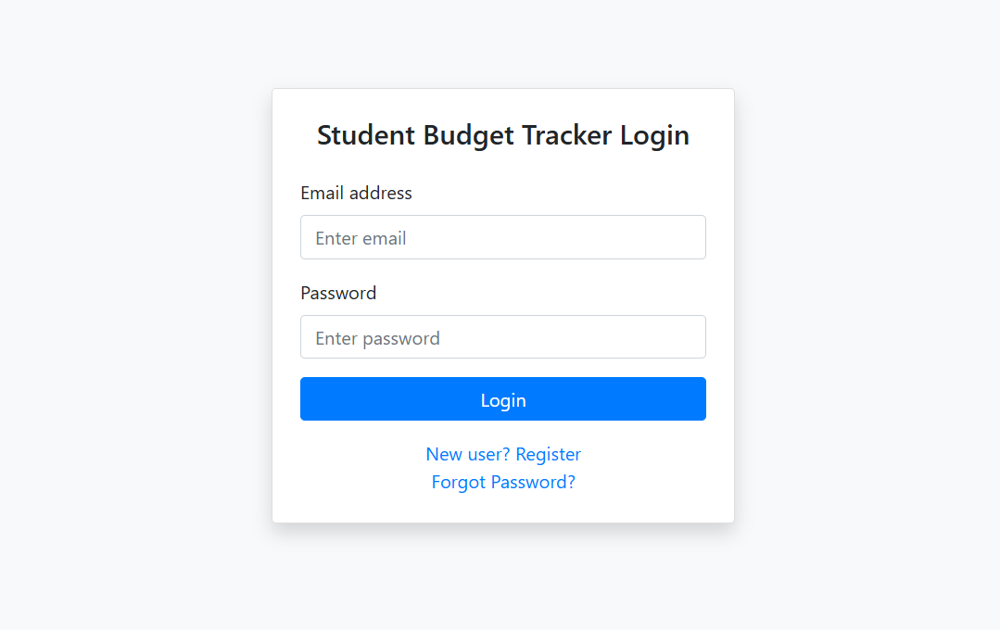

# Student Budget Management System

A web-based application to help students track their income, expenses, and manage their budget efficiently. The system provides intuitive forms, visual reports, and a user-friendly interface for personal finance management.

---

## Table of Contents
- [Features](#features)
- [Requirements](#requirements)
- [Installation & Setup](#installation--setup)
- [File Structure](#file-structure)
- [Libraries Used](#libraries-used)
- [Screenshots](#screenshots)
- [Troubleshooting](#troubleshooting)
- [License](#license)

---

## Features
- User registration and login
- Add, view, and categorize income and expenses
- Visual reports and charts (income vs expenses, category breakdown, trends)
- Account management and settings
- Password reset functionality

---

## Requirements
- PHP 7.x or higher
- MySQL (MariaDB)
- XAMPP (recommended for local development)
- Web browser

---

## Installation & Setup

### 1. Clone or Download the Project
- Place the project folder (`student_budget_management`) in your XAMPP `htdocs` directory:
  - Example: `C:/xampp/htdocs/student_budget_management`

### 2. Start XAMPP Services
- Open XAMPP Control Panel
- Start **Apache** and **MySQL**

### 3. Import the Database
- Open [phpMyAdmin](http://localhost/phpmyadmin)
- Create a new database named: `student_budget_management`
- Click the database, then go to the **Import** tab
- Select the file `student_budget_management.sql` from the project folder and import it

### 4. Configure Database Connection (if needed)
- By default, the database connection settings are in `php/db.php`
- Ensure the username, password, and database name match your local setup (default for XAMPP is user: `root`, password: empty)

### 5. Access the Application
- In your browser, go to: [http://localhost/student_budget_management/](http://localhost/student_budget_management/)
- Register a new account and start using the app!

---

## File Structure
- `index.php` - Login page
- `register.php` - User registration
- `dashboard.php` - Main dashboard after login
- `add_income.php` / `add_expense.php` - Add transactions
- `history.php` - View transaction history
- `report.php` - Visual reports and charts
- `account.php` - Account details
- `settings.php` - User settings
- `reset_password.php`, `forgot_password.php` - Password reset features
- `php/` - Backend PHP scripts (database, authentication, etc.)
- `assets/` - CSS, JS, and icon assets
- `screenshot/` - Project screenshots for documentation

---

## Libraries Used
- [Bootstrap](https://getbootstrap.com/) (UI styling)
- [Chart.js](https://www.chartjs.org/) (charts and graphs)
- [Bootstrap Icons](https://icons.getbootstrap.com/)

---

## Screenshots

Below are sample screenshots of the main pages in the Student Budget Management System:

> **Note:** Screenshot filenames use lowercase and hyphens for clarity (e.g., `add-income.png`).

### 1. Login Page

*The user login screen where registered users can access their accounts.*

### 2. Dashboard

*The main dashboard provides an overview of your financial status, including quick stats and navigation.*

### 3. Add Income

*Form for adding new income entries, specifying amount, source, and date.*

### 4. Add Expense

*Form for recording expenses, including category, amount, and date.*

### 5. History Page

*View a detailed history of all your transactions.*

### 6. Reports Page

*Visual reports and charts summarizing your income, expenses, and spending trends.*

### 7. Settings Page

*User settings page for updating account information and preferences.*

---

## Troubleshooting
- **Database errors:** Ensure the database is imported and connection settings are correct in `php/db.php`.
- **Blank pages or errors:** Check XAMPP's Apache error log for details.
- **Port conflicts:** Make sure Apache and MySQL are running on their default ports (80/3306) or update your configuration accordingly.

---

## License
This project is for educational purposes. 